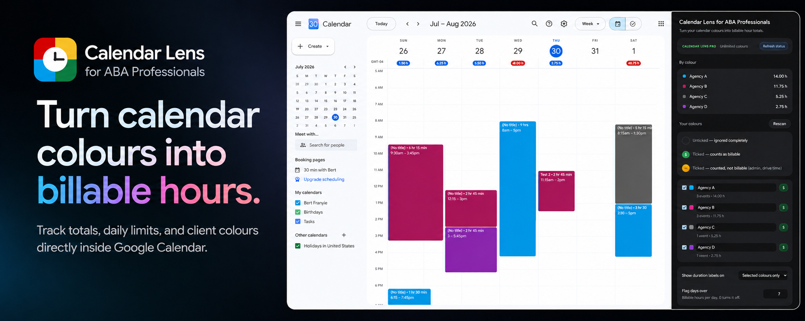
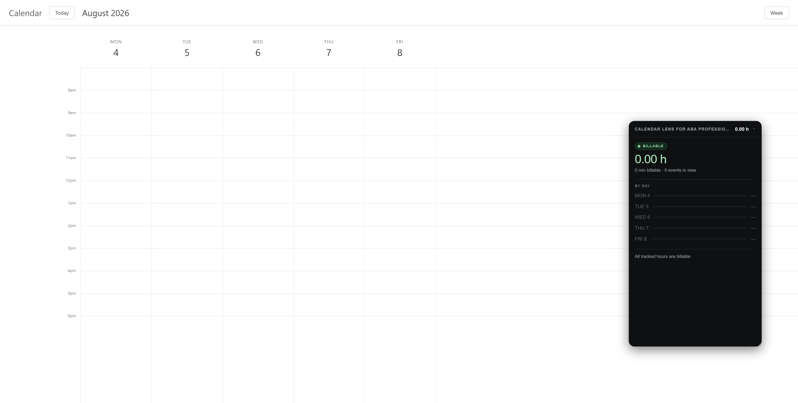
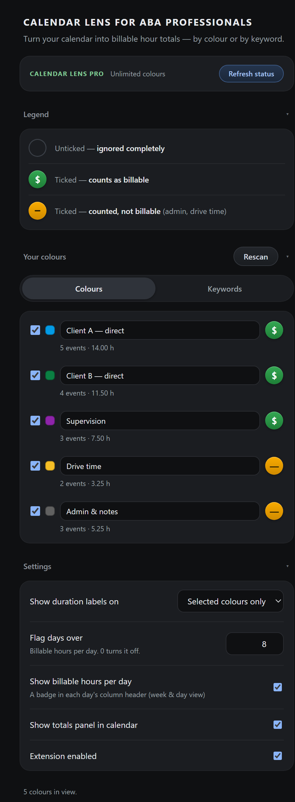
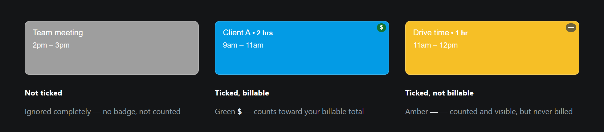
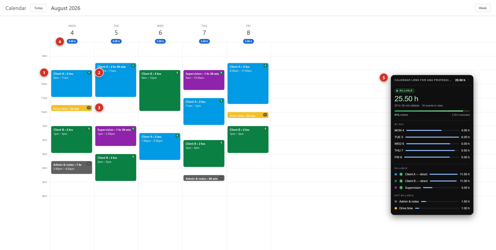
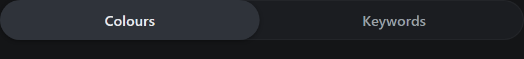
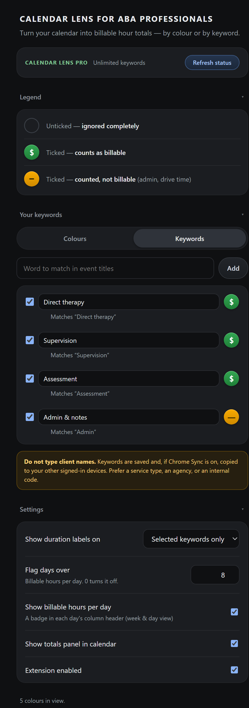
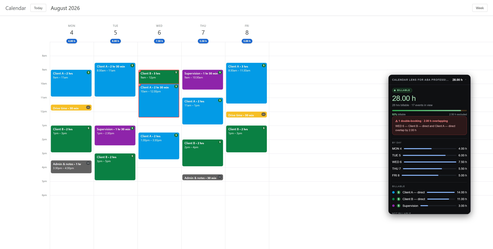
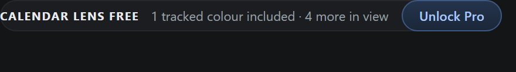

<p align="center">
  
</p>

# Calendar Lens for ABA Professionals

**Turn your Google Calendar into billable hour totals — by colour or by keyword.**

Built for ABA teams — RBTs, BCaBAs and BCBAs — who need to know how many of
their scheduled hours are actually billable.

Match events **by colour** or **by keyword** — whichever fits how you already
work. Colour-code your week, or use the codes and service names already in your
event titles. Either way, tell Calendar Lens what counts and read the total.

---

## Contents

1. [Installing](#1-installing)
2. [Quick start](#2-quick-start-five-minutes)
3. [Colours or keywords](#3-colours-or-keywords)
4. [Reading your calendar](#4-reading-your-calendar)
5. [The totals panel](#5-the-totals-panel)
6. [Double-booking alerts](#6-double-booking-alerts)
7. [Daily limits](#7-daily-limits)
8. [Free and Pro](#8-free-and-pro)
9. [Your privacy](#9-your-privacy)
10. [Troubleshooting](#10-troubleshooting)
11. [Support](#11-support)

---

## 1. Installing

Install from the Chrome Web Store, then open <a href="https://calendar.google.com" target="_blank" rel="noopener noreferrer">Google Calendar</a>.

Click the Calendar Lens icon in your toolbar and the settings panel opens beside
your calendar. Leave it open while you set things up — you'll want to see both.

> Calendar Lens runs on `calendar.google.com` and nowhere else. On every other
> website it does nothing at all.

---

## 2. Quick start (five minutes)

### Step 1 — Start with your colour-coded week

This is an ordinary Google Calendar. Nothing installed yet, nothing to change —
if you already give each client, agency or service type its own colour, you're
ready.



> Don't colour-code yet? Right-click any event in Google Calendar and pick a
> colour. Or skip colours entirely and use
> [keywords](#3-colours-or-keywords) instead.

---

### Step 2 — Open the panel and press Rescan

Click the Calendar Lens icon in your toolbar. The panel opens beside your
calendar and lists every colour currently on screen, with how many events and
hours each one accounts for.



---

### Step 3 — Name each colour, and say whether it's billable

Type what the colour means to you — `Client A — direct`, `Supervision`,
`Drive time`. That name is what shows up in your totals.

Then set each one with the round button on the right. Here is what each setting
looks like on an actual event:



Tick **Drive time** and **Admin** but mark them **not billable** — they stay
visible and counted, without inflating the number you'd actually bill.

---

### Step 4 — Read your week

Your calendar now carries the answer:


Everything on that screen is calculated from what was already there:



**1 — The duration**, written onto the event: `Client A • 2 hrs`. Read from the
time range Google already displays; nothing is added to your calendar.

**2 — The green `$`**, in the corner of every billable event.

**3 — The amber `—`**, on events you count but never bill. Drive time and admin
stay visible without inflating the billable figure.

**4 — That day's billable hours**, under the date. Turns red if you set a daily
limit and go past it.

**5 — The totals panel**: the week's total, what share of it is billable, a
breakdown by day, and one by client or agency.

## 3. Colours or keywords

At the top of that section there's a switch:



**Colours** — the default. Events are matched by the colour they're drawn in.
Best if your calendar is already colour-coded.

**Keywords** — events are matched by words in their titles instead. Best if you
use codes or service names in your event titles and colour is inconsistent.

<p align="center">
  
</p>

Add a keyword and every event whose title contains that word is counted. Matching
is:

- **Case-insensitive** — `supervision` matches `Supervision`
- **Accent-folded** — `Jose` matches `José`
- **Whole words only** — `admin` does **not** match `Administrator`
- **Most specific wins** — with both `therapy` and `direct therapy` tracked,
  *"Direct therapy"* matches the longer one

The two modes are alternatives, not a combination. Switching hides one list and
shows the other — **nothing is deleted**, so you can switch back and find your
setup exactly as you left it.

> ⚠️ **Do not use client names as keywords or labels.** They're saved on your
> device and, if Chrome Sync is on, copied to your other signed-in devices. Use a
> service type, an agency, a funder, or an internal code instead.

---

## 4. Reading your calendar

Once your colours or keywords are set up, your calendar itself changes:

**Every event gets its duration** — `Client session • 1 hr 30 min`, read from the
time range Google already displays.

**Tracked events get a corner badge** — a green **$** for billable, an amber **—**
for counted-but-not-billable. Untracked events get nothing.

**Each day gets an hours badge** under its date, in week and day view.

You can turn any of these off in **Settings**. If you'd rather see durations only
on events you actually track, set **Show duration labels on** to
*Selected colours only* (it reads *Selected keywords only* in keyword mode).

---

## 5. The totals panel

A floating panel sits on your calendar with the numbers:

```
CALENDAR LENS FOR ABA PROFESSIONALS          27.25 h

BILLABLE
27.25 h
27 h 15 min billable · 9 events in view

89% billable          5.25 h excluded

BY AGENCY/CUSTOMER
  ● Client A                          14.00 h
  ● Northshore ABA                    13.25 h
  ● Admin                              5.25 h

BY DAY
  Mon 4                                6.50 h
  Tue 5                                7.25 h
```

**Drag it** by its header to move it. **Drag its bottom-right corner** to resize
it. **Click the header chevron** to collapse it to a single line. It remembers
where you put it.

Before you've marked anything billable, the panel says **Scheduled** rather than
**Billable** — it won't claim a billable figure you never set.

---

## 6. Double-booking alerts

If two **billable** events overlap in time, both are ringed in red on the calendar
with a **!** badge, and the panel names the clash:




```
⚠ 1 double-booking · 2.00 h overlapping
   Tue 5 — Client A and Client B overlap by 2.00 h
```

You can't bill two clients — or the same client twice — for the same hour, so
one of those entries needs fixing.

**What it does not do:**

- Only **billable** events are compared. Admin overlapping a session is normal
  and isn't flagged.
- Back-to-back sessions are **not** overlaps. 9–10 followed by 10–11 is fine.
- It only checks **day and week views**. Month and agenda views don't lay events
  out in a way that reliably says two events share a date.

It's a convenience check, not an audit. It may miss overlaps, and the absence of
a warning is not confirmation that none exist.

---

## 7. Daily limits

In **Settings**, set **Flag days over** to a number of billable hours. Any day
above it turns red — on the calendar badge and in the panel.

Useful for spotting a day that's drifted past what you can actually deliver, or
past what a funder will authorise. Set it to `0` to turn it off.

---

## 8. Free and Pro



**Free** includes **one tracked colour or keyword**, and totals for **the week
you're currently in**. Pick any colour, label it, mark it billable, and get
durations, badges and daily totals for it. Swap which one you track whenever you
like.

**Pro** unlocks:

- **Unlimited colours or keywords** — separate direct therapy, supervision, drive
  time and admin all at once
- **Any week** — past and future, not just the current one

**$4.99 per month.** Cancel any time.

There's no account and no password. Access is tied to the email address you buy
with, and can be restored on another device from a sign-in link sent to that
address — use **Already bought it? Restore purchase** in the panel.

---

## 9. Your privacy

**Your calendar content never leaves your browser.** Event titles, times and
attendees are read on your machine, used to calculate the totals on screen, and
then discarded. Event titles are never stored.

There's no analytics, no tracking and no advertising in the extension.

**What is saved on your device:** the colours or keywords you picked, the names
you gave them, whether each is billable, your daily limit, your display
preferences, and the calculated hour totals. If Chrome Sync is on, Google — not
us — may copy those settings to your other signed-in devices.

**The only network requests** are for the optional Pro subscription. ExtensionPay
handles checkout and paid status, Stripe processes the payment. Neither ever
receives calendar data.

Full detail: <a href="https://wamvytech.com/privacy-aba-calendar.html" target="_blank" rel="noopener noreferrer">Privacy Policy</a> ·
<a href="https://wamvytech.com/terms-aba-calendar.html" target="_blank" rel="noopener noreferrer">Terms of Service</a>

> **Totals reflect scheduled time.** Cancellations, no-shows and sessions that run
> short are not reflected. This is a planning and estimation aid — reconcile
> against delivered sessions before billing.

---

## 10. Troubleshooting

**Nothing appears on my calendar.**
Refresh the Google Calendar tab. The extension reads the page after it loads, so
a tab that was already open when you installed needs one refresh.

**The panel says "No Google Calendar tab is open".**
The figures shown are the last ones read. Open or refresh a calendar tab.

**Rescan doesn't list a colour I can see.**
Rescan only reads what's currently on screen. Scroll so the events are visible,
then press it again. Colours are read from what Google actually draws, so the
full palette works, including the extended colours.

**Two similar colours are being counted together.**
Google draws finished events in a lighter shade of the same colour. Both shades
are counted under one name — the row shows how many shades it merged. If two
genuinely different colours are merging, they're too close for the calendar to
distinguish; change one of them in Google Calendar.

**My totals stopped at the current week.**
Free covers the week you're in. Past and future weeks are Pro.

**I paid but I'm still on Free.**
Press **Refresh status** in the panel. If it doesn't take, use **Restore
purchase** with the email you bought with.

**Month view shows no day totals.**
Day badges and double-booking checks work in day and week view only.

---

## 11. Support

Questions, problems or feature requests:
**[info@wamvytech.com](mailto:info@wamvytech.com)**

We aim to respond within 5 business days.

---

<sub>Calendar Lens for ABA Professionals is made by WamvyTech. Not affiliated with
Google or the BACB.</sub>
